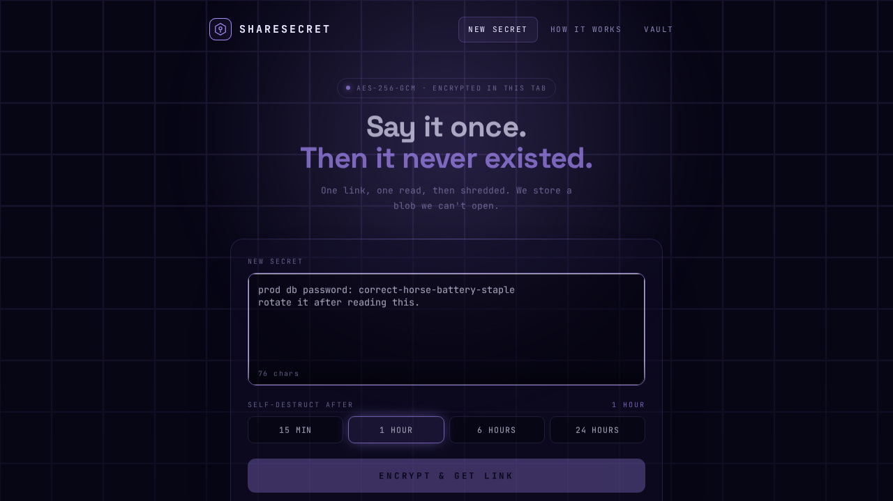
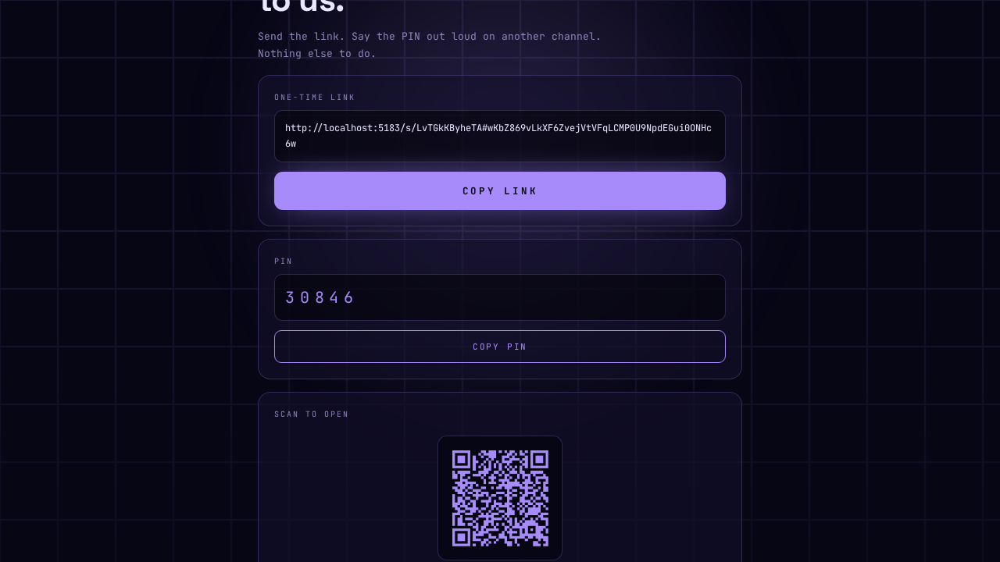
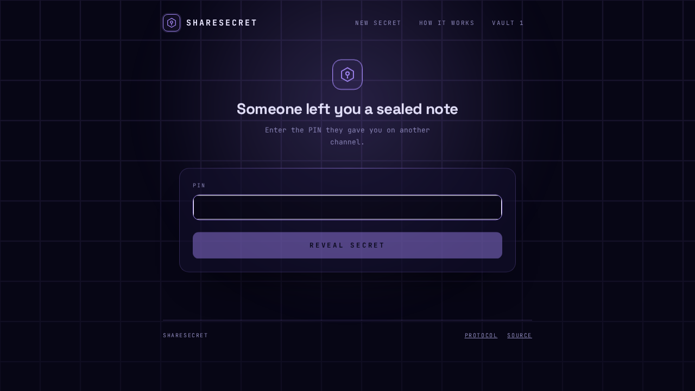
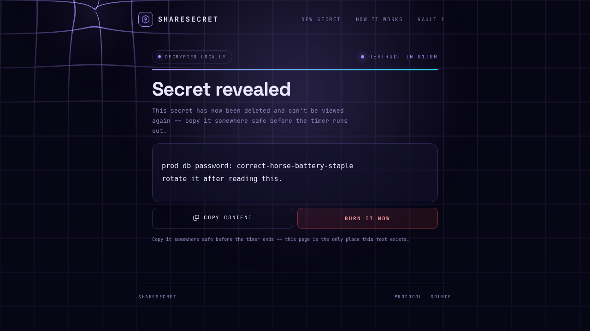
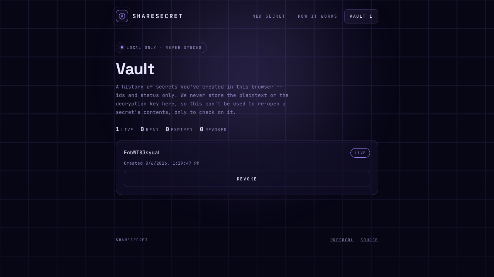
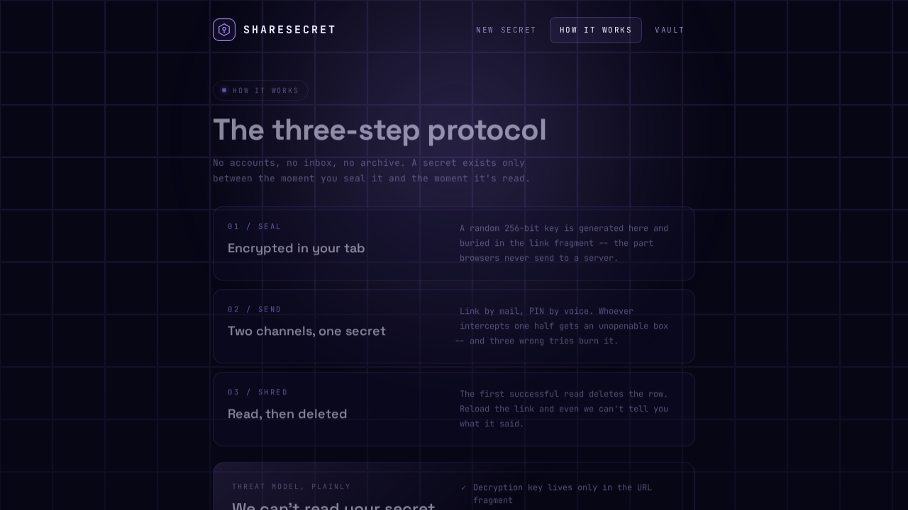

# ShareSecret

Zero-knowledge, one-time secret sharing on Cloudflare Workers.

Inspired by [safesecret.info](https://safesecret.info) — encrypt a message in your browser, share a link and a PIN over
two separate channels, the recipient reads it once and it's gone. The server never sees the plaintext or the decryption
key.

## How it works

1. Your browser generates a random AES-256-GCM key and encrypts your message locally (Web Crypto API). The key never
   leaves your tab.
2. The ciphertext and a PIN (hashed) are sent to the Worker and stored in D1 with an expiry you choose.
3. The decryption key lives only in the URL fragment (`#key`) — fragments are never sent to any server, including this
   one. Send the link one way, say the PIN out loud on another channel.
4. The recipient opens the link, enters the PIN, and the browser decrypts locally. Three wrong PINs burn the secret; a
   successful read deletes it from the server immediately, so it can't be viewed twice.

  
  

## Features

- **One-time reveal.** A successful read deletes the row server-side — reload the link and it's already gone.
- **Live destruct countdown.** The revealed screen shows exactly how long the plaintext stays on screen, with a manual
  "burn it now" to clear it early.
- **PIN protection, three tries.** The link and the PIN are meant for two separate channels; three wrong PIN attempts
  destroy the secret outright.
- **QR code.** Scan to open on another device — the code carries the full link, key included.
- **Vault.** A local-only, browser-side history of what you've sent (ids, timestamps, status) so you can check on or
  revoke a live secret. Never stores the plaintext or the key.
- **No accounts, no tracking.** Nothing to sign up for, no analytics cookie.

  
  

  

## Stack

Cloudflare Workers · Hono · TypeScript · React · D1 · Deno tooling — see [CONTRIBUTING.md](CONTRIBUTING.md) for local
setup, scripts, and the end-to-end test suite.

## Security

See [SECURITY.md](SECURITY.md) for the threat model and how to report vulnerabilities.

## License

[MIT](LICENSE)
